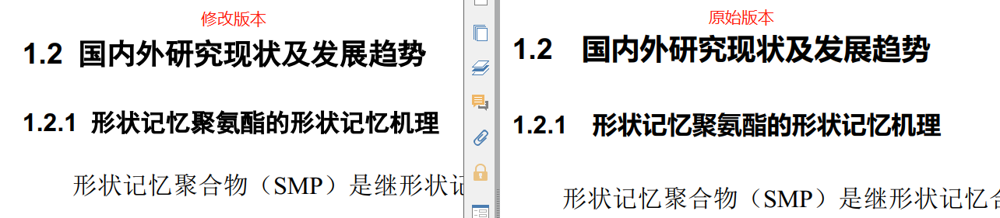
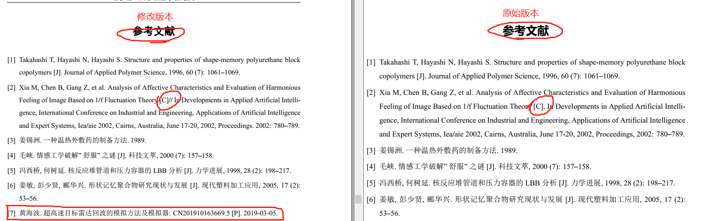
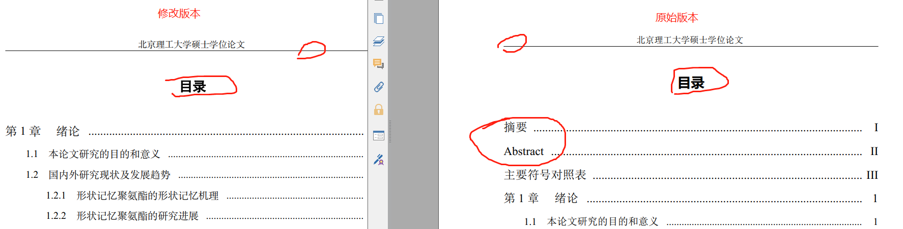

# BIT硕士毕业论文$\LaTeX$模板

## 声明

- **本项目完全继承自https://github.com/BIT-thesis/LaTeX-template**
- **2018年BIT研究生院发布$\LaTeX$学位论文模板https://grd.bit.edu.cn/xwgz/xwgz2/wjxz_xwgz/b117824.htm**
- ==**不保证$\LaTeX$模板格式与word完全一致，使用需谨慎。本项目不承担任何使用后果。**==
- 两个文件夹分别存放原版官方模板和本项目修改后的模板。修改部分仅位于BIT-thesis-grd.cls和GB7714-2005NLang.bst这两个文件。
- 附上BIT毕业论文格式要求和可能需要的字体包。

## 使用说明

- 安装**TexLive**和**TexStudio**（其他Latex软件不清楚是否会出问题）；

- 安装字体：windows系统下直接双击**SimHei.ttf**和**SimSun.ttf**；

- 设置**TexStudio**：

  如上图所示，打开**TexStudio**以后：

  点击选项->设置TexStudio->勾选左下角的显示高级选项->点击左侧菜单栏中的构建->按照图示修改默认编译器。

- 编译tex文件：打开demo.tex点击编译按钮进行编译；

- 其他Latex以及官方模板使用方法见**BIT-Thesis使用指南v1.1.pdf**。

- **其他说明**：

  - 关于bibtex的使用方法与本项目无关。但需注意中文参考文献引用如果作者超出三个，需要在bibtex中加入language={zh}才可以正确显示”等“，否则会显示et.al.
  - 在demo.tex中启用\usepackage[bold-style=ISO]{unicode-math}和\setmathfont{XITS Math}可以使公式字体更好看一点，可能打印出来更清晰。

## 修改日志

修改前后的区别可以分别从修改版本和原始版本的demo.pdf中查看。

### BIT-thesis-grd.cls

- 微调了页眉的高度；
- 修改了标题的部分代码，调整了一级标题到四级标题的段前断后距离；
- 添加了黑体和宋体的相关代码（原版本中的黑体和宋体与word中有差异，修改后的版本基本与word一致）；
- 取消了目录中的中英文摘要；
- 修改了右上角标注参考文献交叉引用时的大小；

### GB7714-2005NLang.bst

- 修改了部分代码，使得其外文会议参考文献变成[C]//的样式。
- 修改了专利的格式，加入了专利号。

### 目前无法在cls文件中统一调整图、表和公式与正文之间的间距，只能在tex文件的代码中修改：
建议修改（具体数值可自行修改）：
- 调整图片的间距：在\end{figure}前边加上一行\vspace{-16bp}；
- 调整表格的间距：在\begin{table}下边加上一行\vspace{-6bp}；在\end{table}前边加上一行\vspace{-10bp}；
- 调整公式的间距：在\begin{equation}或者\begin{align}前边加上两行\abovedisplayskip=3pt和\belowdisplayskip=3pt；

### 部分修改效果展示

## 注：

目前的论文格式与word版本的格式可能仍有差别，可能后续会进行修改。

也可能懒得修改，凑活用吧。又不是毕不了业。

